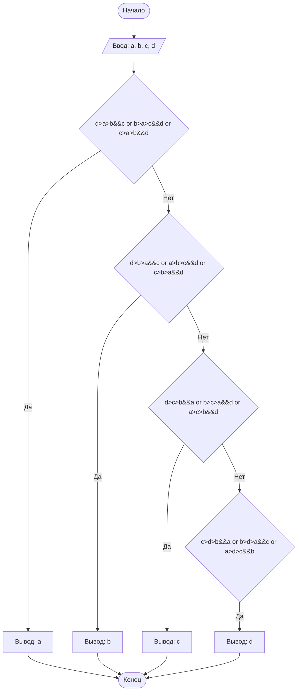

## Отчет по лабораторной работе № 1

#### № группы: `ПМ-2403`

#### Выполнил: `Ковалюсь Фёдор Андреевич`

#### Вариант: `12`

### Cодержание:

- [Постановка задачи](#1-постановка-задачи)
- [Входные и выходные данные](#2-входные-и-выходные-данные)
- [Математическая модель](#25-математическая-модель)
- [Выбор структуры данных](#3-выбор-структуры-данных)
- [Алгоритм](#4-алгоритм)
- [Программа](#5-программа)
- [Анализ правильности решения](#6-анализ-правильности-решения)

### 1. Постановка задачи

- Условия задачи

> На вход программы подается четыре различных целых числа. Вывести
на экран число, которое меньше одного и больше двух других чисел (то есть,
это число в отсортированной последовательности стояло бы третьим).

- Находим 2-ое по величине число из чисел A, B, C, D и выводим его. Для этого создаём четыре сложных условия, из которых только единственное верное.

### 2. Входные и выходные данные
#### Данные на вход
Все числа должны быть различные и удовлетворять условию A<B<C<D
|             | Тип         | min значение    | max значение   |
|-------------|-------------|-----------------|----------------|
| a (Число 1) | Целое число | -10<sup>9</sup> | 10<sup>9</sup> |
| b (Число 2) | Целое число | -10<sup>9</sup> | 10<sup>9</sup> |
| c (Число 3) | Целое число | -10<sup>9</sup> | 10<sup>9</sup> |
| d (Число 4) | Целое число | -10<sup>9</sup> | 10<sup>9</sup> |

#### Данные на выход
Одно целое число, котрое является 2-ым по величине из списка.

### 3. Выбор структуры данных
Для решения задачи подойдут простые целочисленные переменные. Будем использовать:
-	Переменные типа int для хранения входных данных a, b, c, d.
  
### 4. Алгоритм
#### Алгоритм выполнения программы:
1. Ввести четыре целых чисел: a ,b, c, d.
2. Проверить условия:
- Если a подходит под заданное условие, то вывести a (участок 1).
-	Если b подходит под заданное условие, то вывести b (участок 2).
-	Если c подходит под заданное условие, то вывести c (участок 3).
-	Если d подходит под заданное условие, то вывести d (участок 4).
3.  Завершить программу.
 	
#### Блок-схема

### 5. Программа


import java.util.Scanner;

public class ThirdNumber {

    public static void main(String[] args) {
        Scanner scanner = new Scanner(System.in);

        System.out.print("Введите первое число: ");
        int num1 = scanner.nextInt();

        System.out.print("Введите второе число: ");
        int num2 = scanner.nextInt();

        System.out.print("Введите третье число: ");
        int num3 = scanner.nextInt();

        System.out.print("Введите четвертое число: ");
        int num4 = scanner.nextInt();

        // Находим "третье" число без сортировки
        int third = findThird(num1, num2, num3, num4);

        System.out.println("Третье число: " + third);
    }

    // Функция для поиска "третьего" числа
    static int findThird(int a, int b, int c, int d) {
        // Используем комбинации сравнений для определения "третьего" числа
        if ((a < b && a > c && a > d) || (a < c && a > b && a > d) || (a < d && a > b && a > c)) {
            return a;
        } else if ((b < a && b > c && b > d) || (b < c && b > a && b > d) || (b < d && b > a && b > c)) {
            return b;
        } else if ((c < a && c > b && c > d) || (c < b && c > a && c > d) || (c < d && c > a && c > b)) {
            return c;
        } else {
            return d;
        }
    }
}


```java
import java.util.Scanner;

public class Main {
    public static void main(String[] args) {
        // Создаем сканер для считывания входных данных
        Scanner scanner = new Scanner(System.in);

        // Вводим данные
        int X = scanner.nextInt();
        int A = scanner.nextInt();
        int B = scanner.nextInt();
        int C = scanner.nextInt();
        int D = scanner.nextInt();

        // Логика проверки положения точки X
        if (X < A) {
            System.out.println(1); // Участок 1
        } else if (X < B && X > A) {
            System.out.println(2); // Участок 2
        } else if (X < C && X > B) {
            System.out.println(3); // Участок 3
        } else if (X < D && X > C) {
            System.out.println(4); // Участок 4
        } else if (X > D) {
            System.out.println(5); // Участок 5
        } else {
            System.out.println("Введённые числа не соответсвуют условиям задачи, они должны быть различны");
        }

        // Закрываем сканер
        scanner.close();
    }
}


```
### 6. Анализ правильности решения
