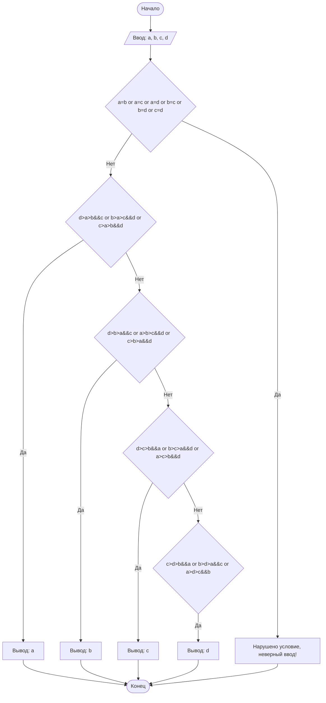

 ## Отчет по лабораторной работе № 1

#### № группы: `ПМ-2403`

#### Выполнил: `Ковалюсь Фёдор Андреевич`

#### Вариант: `12`

### Cодержание:

- [Постановка задачи](#1-постановка-задачи)
- [Входные и выходные данные](#2-входные-и-выходные-данные)
- [Выбор структуры данных](#3-выбор-структуры-данных)
- [Алгоритм](#4-алгоритм)
- [Программа](#5-программа)
- [Анализ правильности решения](#6-анализ-правильности-решения)

### 1. Постановка задачи

- Условия задачи

> На вход программы подается четыре различных целых числа. Вывести
на экран число, которое меньше одного и больше двух других чисел (то есть,
это число в отсортированной последовательности стояло бы третьим).

- Находим 3-ее число из списка чисел a, b, c, d и выводим его.
- Для этого проверяем заданное условие и создаём четыре сложных условия,
  из которых только единственное верное выводится при отсутствии ошибок ввода. 

### 2. Входные и выходные данные
#### Данные на вход
Все числа должны быть различные и целые
|             | Тип         | min значение    | max значение   |
|-------------|-------------|-----------------|----------------|
| a (Число 1) | Целое число | -10<sup>9</sup> | 10<sup>9</sup> |
| b (Число 2) | Целое число | -10<sup>9</sup> | 10<sup>9</sup> |
| c (Число 3) | Целое число | -10<sup>9</sup> | 10<sup>9</sup> |
| d (Число 4) | Целое число | -10<sup>9</sup> | 10<sup>9</sup> |

#### Данные на выход
Одно целое число, котрое является 2-ым по величине из списка.

### 3. Выбор структуры данных
Для решения задачи подойдут простые целочисленные переменные. Будем использовать:
-	Переменные типа int для хранения входных данных a, b, c, d.
  
### 4. Алгоритм
#### Алгоритм выполнения программы:
1. Ввести четыре целых чисел: a ,b, c, d.
2. Проверить условия:
- Если заданное условие нарушено, то вывести "Нарушено условие, неверный ввод!" (участок 5).
- Если a подходит под заданное условие, то вывести a (участок 1).
-	Если b подходит под заданное условие, то вывести b (участок 2).
-	Если c подходит под заданное условие, то вывести c (участок 3).
-	Если d подходит под заданное условие, то вывести d (участок 4).
3.  Завершить программу.
 	
#### Блок-схема

### 5. Программа

```java
import java.io.PrintStream;
import java.util.Scanner;
public class Main {
    public static Scanner in = new Scanner(System.in);
    public static PrintStream out = System.out;
    public static void main(String[] args) {
        // Вводим данные
        int a = in.nextInt();
        int b = in.nextInt();
        int c = in.nextInt();
        int d = in.nextInt();

        // Описываем условие ввода (точнее условие, при котором не осуществляется ввод)
        if ( a==b || a==c || a==d || b==c || b==d || c==d) {
            out.print("Нарушено условие, неверный ввод!");
        }
        // Описываем поочерёдно 4 сложных условия
        else if ((a < b && a > c && a > d) || (a < c && a > b && a > d) || (a < d && a > b && a > c)) {
            out.print(a);
        }
        else if ((b < a && b > c && b > d) || (b < c && b > a && b > d) || (b < d && b > a && b > c)) {
            out.print(b);
        }
        else if ((c < a && c > b && c > d) || (c < b && c > a && c > d) || (c < d && c > a && c > b)) {
            out.print(c);
        }    
        else if  ((d < a && d > b && d > c) || (d < b && d > a && d > c) || (d < c && d > a && d > b)) {
            out.print(d);
        }
    }
}

```

### 6. Анализ правильности решения

1. Тест на работу с  отрицательными числами
- Input:
    ```
    -3 -5 -1 -7
    ```

- Output:
    ```
    -3
    ```

2. Тест на работу с отрицательными и неотрицательными числами

- Input:
    ```
    7 0 -19 123
    ```

- Output:
    ```
    7
    ```

3. Тест на работу с неотрицательными числами

- Input:
    ```
    10 100 5 50
    ```

- Output:
    ```
    50
    ```

4. Тест на работу с повторяющимися числами

- Input:
    ```
    10 100 10 5
    ```

- Output:
    ```
   Нарушено условие, неверный ввод!
    ```
